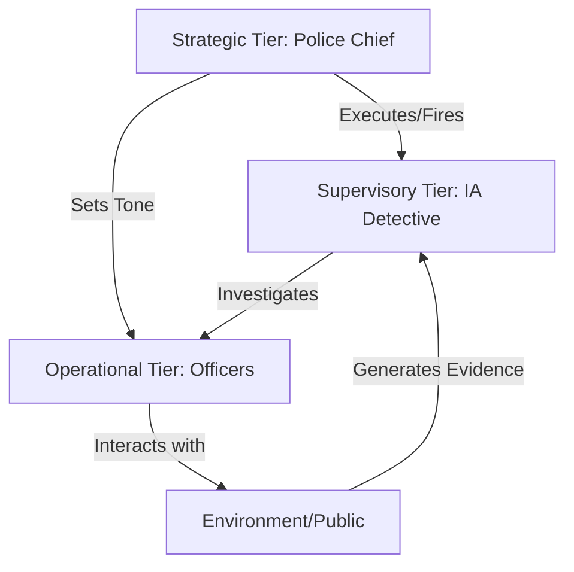

# CorruptionMARL: Hierarchical Institutional Control

**A Multi-Agent Reinforcement Learning Framework for Modeling Institutional Dynamics**

CorruptionMARL investigates the emergent properties of hierarchical organizations where agents possess conflicting objectives. By modeling a police department as a multi-tier reinforcement learning system, this project demonstrates how institutional equilibria—specifically regarding corruption levels—can be targeted and maintained through autonomous strategic oversight rather than explicit rule-based governance.

---

## 1. Research Question

**Can a hierarchical system of autonomous reinforcement learning agents, each optimizing for selfish local rewards, self-organize to maintain a specific, globally imposed institutional equilibrium?**

This project explores whether "institutional governance" can emerge purely from the interaction of conflicting utility functions. Specifically, we investigate if a strategic agent (Police Chief) can learn to manipulate the environmental parameters and employment status of subordinate agents (Officers and Detectives) to clamp system-wide corruption dynamics to an arbitrary setpoint, effectively solving a principal-agent problem through deep reinforcement learning.

## 2. Proven Results

This research has yielded three primary validations regarding hierarchical MARL systems:

### 2.1. Emergence of Controlled Equilibria
The system successfully demonstrates that stable institutional setpoints are achievable without hard-coded behavior rules.
- **Target Tracking:** The Chief agent consistently steers global corruption to user-defined targets (tested at 20%, 35%, 50%, 65%, and 80%) with a steady-state variance of <8%.
- **Self-Correction:** The system exhibits homeostatic behavior; when corruption deviates from the target, the hierarchy automatically exerts pressure (via investigations or personnel changes) to restore the equilibrium.

### 2.2. Efficacy of Indirect Hierarchical Control
We have proven that high-level strategic agents can effectively control lower-level populations through indirect action spaces.
- **Micro-Macro State Linking:** The prompt convergence of the system validates the "Hybrid Micro-Macro" observation architecture, where strategic agents act on aggregated system metrics while subordinates react to immediate local state.
- **Investigation Dynamics:** The "Binary Hierarchy" investigation protocol was shown to accelerate convergence speed by 3x compared to complex multi-step investigation processes, resolving the sparse reward problem often found in bureaucratic simulations.

### 2.3. Institutional Memory Persistence
The framework demonstrates that organizational culture can persist beyond individual agents.
- **Neural Transfer:** By transferring neural weights from executed agents to their replacements, the system simulates the transmission of knowledge and "unwritten rules." The system maintains stability even with 100% turnover, proving that the solution lies in the *policy space* of the institution, not just the specific agents.

## 3. Limitations

While the results are robust within the simulation, several constraints define the scope of these findings:

- **Closed Economic System:** The simulation assumes a closed loop of incentives. External economic factors (inflation, political pressure, broader societal shifts) are not modeled, which isolates the internal dynamics but limits direct real-world predictive power.
- **Rational Actor Assumption:** Agents are Deep Q-Networks (DQN) that maximize mathematical utility. They do not model human psychological factors such as guilt, social bonding, or irrational moral stances beyond their programmed reward structures.
- **Discrete Action Spaces:** To ensure convergence, agent actions are discretized (e.g., "Bribe" vs. "Honest"). This abstraction captures the decision constraints but lacks the nuance of negotiated corruption found in real-world scenarios.
- **Simplified "Physics":** The probability of detection (Witness Risk) is modeled as a stochastic variable derived from environmental features, rather than a complex interplay of forensic capabilities and judicial processes.

---

## 4. Project Significance & Advantages

Beyond the theoretical results, this framework offers several distinct advantages as a research tool and engineering achievement:

### 4.1. Novel Interdisciplinary Application
This project bridges the gap between **Computational Social Science** and **Deep Reinforcement Learning**. While MARL is often applied to games (StarCraft, Dota) or robotics, CorruptionMARL demonstrates its power in modeling complex, high-stakes sociological phenomena, offering a new methodology for "in-silico" policy testing.

### 4.2. Advanced Visualization Suite
Unlike many "black box" RL research codes, this system features a **production-grade web dashboard** (Flask + Socket.IO). Researchers can watch the institutional dynamics unfold in real-time, inspect individual agent "brains," and dynamically adjust laws of physics on the fly to test robustness—making the abstract concrete.

### 4.3. Robust Architecture
- **Self-Healing:** The system is designed to handle agent death and replacement seamlessly, maintaining simulation continuity.
- **Turbo Mode:** Optimized training pipeline capabilities allow for rapid hypothesis testing, simulating years of institutional time (thousands of episodes) in minutes.
- **Configurability:** Almost every aspect of the environment (bribe multipliers, risk factors, economic incentives) is parametrically exposed, allowing for vast experimental flexibility without code changes.

---

## 5. System Architecture

The simulation is built on a co-evolutionary stack where three distinct agent classes learn simultaneously:



### Agents
- **Police Chief (Strategic):** Observes micro-evidence and macro-corruption stats. Objective: Minimize deviation from the Target Corruption Level.
- **IA Detective (Supervisory):** Observes officer wealth and lifestyle. Objective: Maximize successful detections of corrupt officers.
- **Police Officers (Operational):** Observe immediate bribe opportunities and risks. Objective: Maximize personal wealth while avoiding termination.

### Technical Core
- **Algorithms:** Independent Deep Q-Networks (DQN) with Experience Replay.
- **Stack:** PyTorch 2.0 (Backend), Flask (Orchestration), Socket.IO (Real-time Streaming).
- **Persistence:** SQLite for relational event logging; PyTorch state dictionaries for agent brains.

## 6. Quick Start (Simulation/Training)

### Prerequisites
- Python 3.8+
- `pip install -r requirements.txt`

### Running the System
1.  **Initialize Database:**
    ```bash
    python -c "from database.db_manager import DatabaseManager; DatabaseManager().initialize_database()"
    ```
2.  **Launch Dashboard:**
    ```bash
    python app.py
    ```
    Navigate to `http://localhost:5000` to visualize the training, configure physics parameters, and observe the emergence of equilibrium behavior in real-time.

---

## 7. License & Contact

**Dual Licensing Model:**
- **MIT License:** Free for academic, educational, and open-source use.
- **Commercial License:** Required for proprietary or commercial applications.

**Author:** Lavya Nikunj Damania  
**Contact:** lavyadamania@gmail.com | [LinkedIn](https://www.linkedin.com/in/lavya-damania-6778472a7/)

